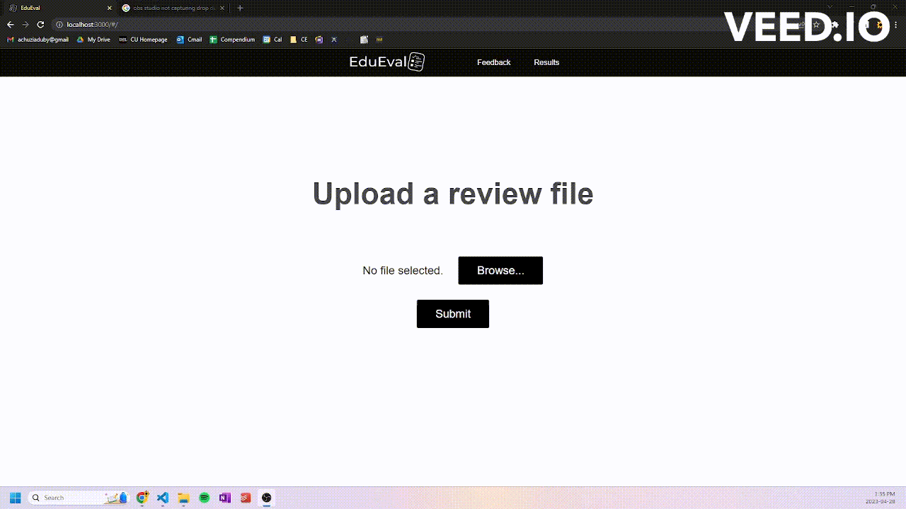

  
A language machine learning model that condenses student professorial reviews into a concise summary for the faculty to
review during each semester's performance reviews. This model was originally hypothesized and developed by the 
[QMAGS](#developers) to aid with student representation in performance reviews at Carleton.

## Developers
- Matteo Golin
- Hamnah Qureshi
- Grant Achuzia
- Jad Mohieldin

## Requirements
- Python 3.11+
- Modules in `requirements.txt`

## Tools & Technologies

